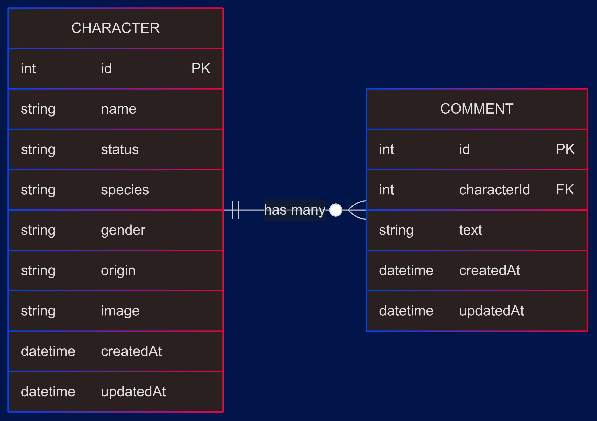

# rick-morty-api

Proyecto de servicio web API REST tomando como referencia la famosa API de Rick y Morty. Tecnologías utilizadas:

- Express
- GraphQL
- Sequelize
- MySQL
- Typescript
- Redis

### Algunas de las funcionalidades del servicio:

- Obtener personajes filtrados por diferentes propiedades
- Cacheo de los datos de retorno de la API con redis
- Cron JOB para reestablecer los datos de los personajes de manera aleatoria
- Añadir comentarios a los personajes

### Diagrama ERD de la base de datos:



## Pasos para correr el proyecto

Primero, es necesario tener docker y docker compose instalado para montar la base de datos y el cliente de redis:

```
docker-compose up -d
```

Luego, necesitamos crear el archivo .env y rellenar las variables de entorno que es encuentra en `.env.template`

Posterior a eso, instalamos las dependecias del proyecto

```
pnpm i
```

Para ejectar en modo desarrollo:

```
pnpm run dev
```


Para correr la suit de tests:

```
pnpm run test
```